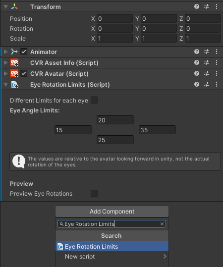

# EyeMovementFix

This CCK Mod component allows you to define eye rotation limits on your avatars.

## Installation & Usage

1. Download and import `EyeMovementFixCCKMod.unitypackage` from the releases into your unity project.
2. Go to the root of your avatar (where the `CVR Avatar` script is located) and add the component `Eye Rotation Limits`.
3. You will get presented with something like the image bellow:
   
4. You can configure the limits for the eye angles, and click the `Preview Eye Rotations` and play with the sliders to
   see what it will look on your avatar.
5. After you got values that you're satisfied with, you can upload the avatar (don't remove the script from the avatar).

## Notes

1. The preview will rotate your eye bones, and it should restore the rotations when you stop previewing. But if you want
   to be entirely safe, create a duplicate of your avatar to do the
   previewing.
2. The limits will only be enforced if the person seeing your avatar has
   the [EyeMovementFix](https://github.com/kafeijao/Kafe_CVR_Mods/tree/master/EyeMovementFix) mod installed.

---

## Disclosure

> ---
> ⚠️ **Notice!**  
>
> This mod's developer(s) and the mod itself, along with the respective mod loaders, have no affiliation with ABI!
>
> ---
